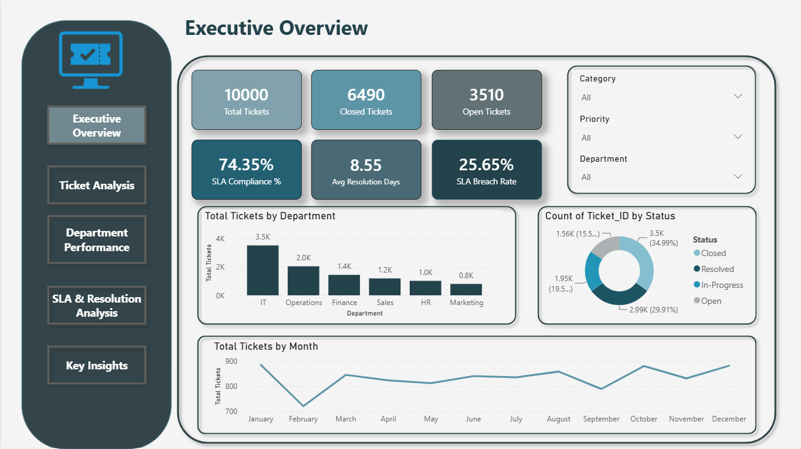
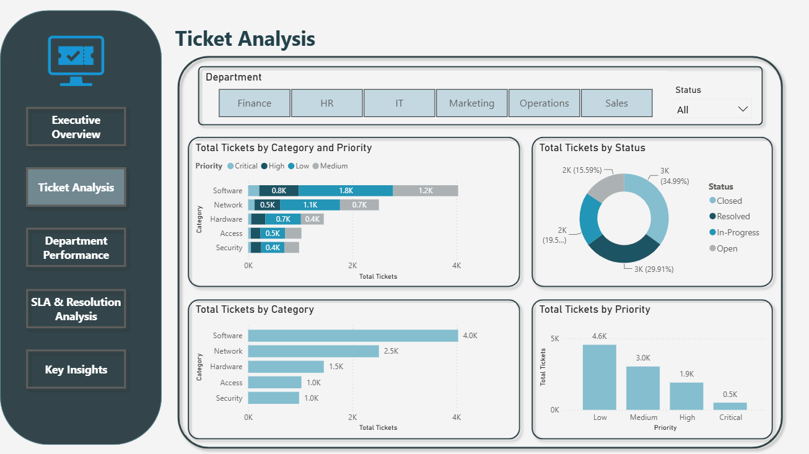
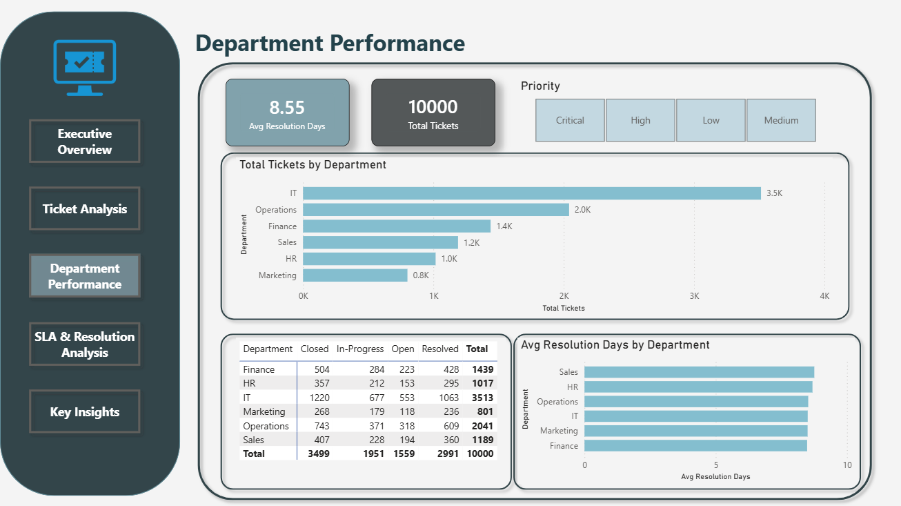
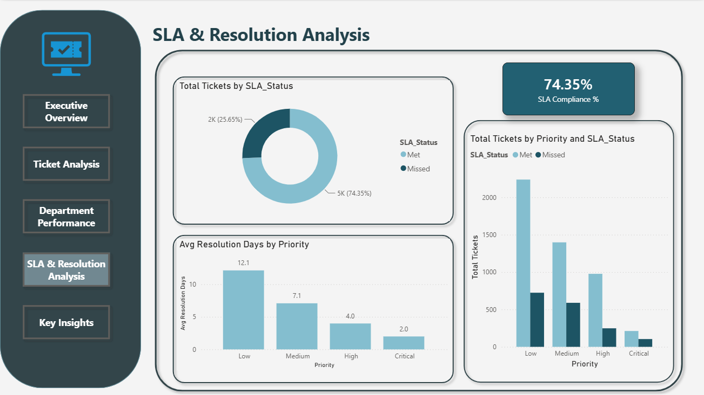
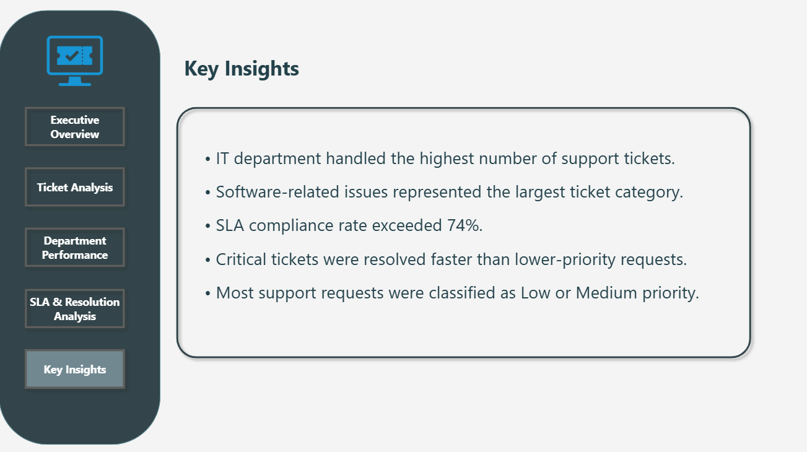

# IT Service Desk Analytics Dashboard

## Project Overview

This project analyzes IT Service Desk operations using Python, SQL, and Power BI.

The dataset simulates real-world ITSM ticket records, including ticket status, priority, department workload, SLA performance, and resolution times.

The objective was to identify service trends, evaluate department performance, monitor SLA compliance, and generate actionable insights through interactive dashboards.

## Project Background

This project was inspired by my exposure to IT Service Management (ITSM) processes during my cooperative training experience. After working with service desk operations and ticket management workflows, I wanted to apply my data analytics skills to a realistic business scenario by building an end-to-end analytics solution using Python, SQL, and Power BI.

## Business Problem

IT Service Desk teams often handle thousands of support requests across multiple departments. Without proper analysis, it becomes difficult to identify workload distribution, monitor SLA performance, detect service bottlenecks, and evaluate operational efficiency.

This project was developed to simulate a real-world IT Service Management (ITSM) environment and provide data-driven insights that support better decision-making and service performance monitoring.

## Project Objective

The objective of this project is to:

- Analyze service desk ticket trends.
- Monitor SLA compliance performance.
- Evaluate department workloads.
- Measure ticket resolution efficiency.
- Identify areas for operational improvement through interactive dashboards.

## Tools Used

- Python
- Pandas
- SQL
- Power BI
- DAX

## Key Analysis Areas

- Ticket Volume Analysis
- Department Performance
- SLA Compliance Monitoring
- Resolution Time Analysis
- Priority-Based Service Evaluation

## Key Findings

- IT generated the highest ticket volume across all departments.
- Software-related issues represented the largest ticket category.
- Overall SLA compliance reached 74.35%.
- Critical tickets were resolved significantly faster than low-priority tickets.
- Operations and IT handled the highest service workloads.

## Dashboard Preview

### Executive Overview

### Ticket Analysis

### Department Performance

### SLA & Resolution Analysis

### Key Insights

